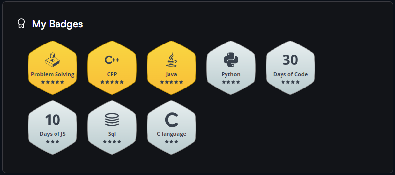
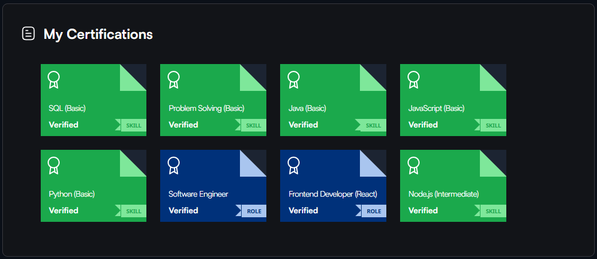

  

    

  

    
    
    
  

  <h1>Hi, I'm Shubham Singh 👋</h1>
  <h3>Senior Full-Stack Engineer & AI Architect</h3>

  

    <b>Architecting scalable Next.js web applications, distributed backend microservices, and autonomous Voice AI systems.</b>
  

  

    
    
    
    
    
  

---

## ⚡ Engineering Overview & Architecture Mindset

  

    
    
    
    
    
  

<table>
  <tr>
    <td width="60%" valign="top">
      <h3>🚀 Engineering Executive Summary</h3>
      
I engineer mission-critical, high-throughput digital systems across the complete software lifecycle — from sub-second <b>Next.js 15 App Router</b> frontends and scalable <b>Node.js / Python microservices</b> to autonomous <b>Agentic Voice AI workflows</b> (Vapi, Twilio, n8n).

      
My engineering philosophy focuses on <b>architectural precision, zero-bloat modularity, and production resilience</b>. Whether automating multi-step telephony pipelines, architecting performant MongoDB/PostgreSQL schemas, or containerizing zero-downtime microservices on AWS, I build software designed to scale effortlessly under real-world demand.

      

        🎯 <b>Current Mandate:</b> Leading scalable backend architecture, real-time telephony pipelines, and cloud orchestration across Docker, PM2, and AWS.
      

    </td>
    <td width="40%" valign="top">
      <h3>📊 Developer Dossier</h3>
      <b>📍 Location:</b> Noida, Uttar Pradesh, India 
      <b>💼 Current Role:</b> Senior Analyst & Full-Stack / AI Architect 
      <b>🎓 Education:</b> MCA — MMMUT (CGPA: 8.34) 
      <b>⚡ Availability:</b> Senior Roles & High-Impact Consulting 
      <b>🌐 Portfolio:</b> <a href="https://shubhtech.online/">shubhtech.online</a> 
      <b>📝 Engineering Blog:</b> <a href="https://shubhtech.online/blog">shubhtech.online/blog</a> 
      <b>📫 Direct Email:</b> <a href="mailto:shubhsingh1515@gmail.com">shubhsingh1515@gmail.com</a>
    </td>
  </tr>
</table>

---

## 💡 Core Technical Capabilities

<table>
  <tr>
    <td width="50%" valign="top">
      <h3>💻 Full-Stack Web Architecture</h3>
      
Building sub-second, accessible web applications using <b>React 19</b> and <b>Next.js 15 App Router</b> with Server Components, SSR/SSG/ISR, strict TypeScript typing, and Tailwind CSS design systems.

      

        
        
        
        
      

    </td>
    <td width="50%" valign="top">
      <h3>⚙️ Distributed Backend & Microservices</h3>
      
Engineering high-throughput REST APIs and async streaming microservices with <b>Node.js, Express.js, and Python (FastAPI/Django)</b>. Resilient middleware pipelines, Redis caching, and rate limiting.

      

        
        
        
        
      

    </td>
  </tr>
  <tr>
    <td width="50%" valign="top">
      <h3>🤖 Agentic AI & Telephony Automation</h3>
      
Architecting autonomous inbound/outbound voice assistants with <b>Vapi</b>, programmable telephony with <b>Twilio</b>, complex multi-step <b>n8n</b> webhook workflows, and OpenAI Realtime agents.

      

        
        
        
        
      

    </td>
    <td width="50%" valign="top">
      <h3>🔐 Auth, Security & Real-Time</h3>
      
Implementing battle-tested security with <b>JWT, OAuth 2.0, RBAC, session management</b>, and webhook signature verification alongside bidirectional real-time communication via <b>Socket.io</b>.

      

        
        
        
      

    </td>
  </tr>
  <tr>
    <td width="50%" valign="top">
      <h3>🗄️ Database Architecture & Optimization</h3>
      
Designing performant schemas, indexing strategies, and complex document aggregation pipelines in <b>MongoDB</b>, paired with relational modeling in <b>PostgreSQL and MySQL</b>.

      

        
        
        
      

    </td>
    <td width="50%" valign="top">
      <h3>☁️ Cloud, DevOps & Production</h3>
      
Containerizing workloads with <b>Docker</b>, zero-downtime clustering with <b>PM2</b>, Linux server administration, AWS EC2/S3 cloud deployments, and automated <b>CI/CD pipelines</b>.

      

        
        
        
        
      

    </td>
  </tr>
</table>

---

## 🛠️ Technical Skills Ecosystem

### Languages

  
  
  
  
  
  
  
  

### Frontend Engineering

  
  
  
  
  

### Backend & Real-Time APIs

  
  
  
  
  
  

### AI & Workflow Automation

  
  
  
  
  
  

### Databases

  
  
  
  

### Cloud, DevOps & Tooling

  
  
  
  
  
  
  

---

## 🚀 Featured Production Projects

<table>
  <tr>
    <td width="50%" valign="top">
      <h3>🧺 DryDash Web & Admin Logistics Platform</h3>
      
Full-stack MERN on-demand laundry and dry-cleaning portal paired with an enterprise operations dashboard for real-time order tracking, warehouse management, driver dispatch, and automated billing.

      
<b>Tech Stack:</b> React, Node.js, Express, MongoDB, Redux, Tailwind CSS

      

        🔗 <a href="https://drydash.in/" target="_blank"><b>Live Platform</b></a> | 
        📑 <a href="https://shubhtech.online/projects/drydash-web-admin-platform" target="_blank"><b>Case Study</b></a>
      

    </td>
    <td width="50%" valign="top">
      <h3>📱 DryDash Mobile Application</h3>
      
Cross-platform mobile application (iOS & Android) for scheduled on-demand laundry pickups, stage-by-stage order status tracking, custom garment care preferences, and instant checkout.

      
<b>Tech Stack:</b> React Native, Node.js, Express, MongoDB, Push Notifications

      

        🔗 <a href="https://drydash.in/" target="_blank"><b>Portal & Downloads</b></a> | 
        📑 <a href="https://shubhtech.online/projects/drydash-mobile-app" target="_blank"><b>Case Study</b></a>
      

    </td>
  </tr>
  <tr>
    <td width="50%" valign="top">
      <h3>🤖 Life Management AI Engagement Platform</h3>
      
Enterprise customer adherence and habit-tracking platform with autonomous conversational AI. Features scheduled phone call interventions, personalized notification loops, and multi-node event handling.

      
<b>Tech Stack:</b> React, Redux, Node.js, Twilio Voice/SMS, n8n Workflows

      

        🔗 <a href="https://life.avertisystems.com/app" target="_blank"><b>Live Application</b></a> | 
        📑 <a href="https://shubhtech.online/projects/life-management-platform" target="_blank"><b>Case Study</b></a>
      

    </td>
    <td width="50%" valign="top">
      <h3>📞 Autonomous Voice AI Auto-Dialer</h3>
      
High-throughput automated outbound dialing engine powered by Vapi speech models and Twilio telephony. Manages lead lists, conversational AI dialogue, webhook callbacks, and CRM synchronization.

      
<b>Tech Stack:</b> Vapi Voice AI, Twilio Voice SDK, n8n, Node.js, OpenAI API

      

        📑 <a href="https://shubhtech.online/projects/auto-dialer-system" target="_blank"><b>Case Study & Architecture</b></a>
      

    </td>
  </tr>
  <tr>
    <td width="50%" valign="top">
      <h3>🎙️ Programmable Dialer Application</h3>
      
Web-based softphone and call orchestration dashboard built with Next.js and Node.js Express. Implements real-time call controls, bi-directional audio streaming, and Twilio Voice SDK telemetry.

      
<b>Tech Stack:</b> Next.js, Node.js, Express, Twilio Voice SDK, Tailwind CSS

      

        🔗 <a href="https://dialer-liart.vercel.app/" target="_blank"><b>Live Demo</b></a> | 
        📑 <a href="https://shubhtech.online/projects/dialer-application" target="_blank"><b>Case Study</b></a>
      

    </td>
    <td width="50%" valign="top">
      <h3>🎧 Midtown AV / DJ Rentals Platform</h3>
      
High-conversion audio-visual equipment rental platform featuring live calendar availability, tiered equipment booking, administrative logistics control, and dual Stripe & PayPal checkout.

      
<b>Tech Stack:</b> Next.js, Node.js, MongoDB, Stripe, PayPal, Tailwind CSS

      

        🔗 <a href="https://midtownav.btruetech.com/" target="_blank"><b>Live Platform</b></a> | 
        📑 <a href="https://shubhtech.online/projects/dj-rentals-platform" target="_blank"><b>Case Study</b></a>
      

    </td>
  </tr>
</table>

  

    <a href="https://shubhtech.online/projects" target="_blank">
      <b>👉 Explore All 15+ Production Projects on shubhtech.online</b>
    </a>
  

---

## 📝 Recent Engineering Blogs & Technical Publications

  
In-depth technical guides, architectural breakdowns, AI protocols, and production DevOps published on <a href="https://shubhtech.online/blog"><b>shubhtech.online/blog</b></a> and <a href="https://shubh1515.medium.com/"><b>Medium</b></a>.

<table>
  <tr>
    <td width="50%" valign="top">
      <h4>🛡️ Engineering Secure AI Agents: Permissions, Sandboxing & Zero Trust</h4>
      
As autonomous AI agents gain access to APIs, databases, files, and tools, security becomes critical. A practical guide to least-privilege permissions, runtime sandboxing, Zero-Trust architecture, secrets protection, human-in-the-loop approvals, and continuous auditing.

      

        
        
      

      

        📖 <a href="https://shubhtech.online/blog/engineering-secure-ai-agents-permissions-sandboxing-and-zero-trust" target="_blank"><b>Read on shubhtech.online</b></a> &nbsp;|&nbsp; 
        <a href="https://shubh1515.medium.com/engineering-secure-ai-agents-permissions-sandboxing-and-zero-trust-42f8e72f229a" target="_blank"><b>Medium ↗</b></a>
      

    </td>
    <td width="50%" valign="top">
      <h4>🌐 Understanding Google’s A2A Protocol for AI Agent Communication</h4>
      
An architectural deep dive into Google's Agent-to-Agent (A2A) Protocol, explaining how autonomous AI agents securely communicate, collaborate, and exchange tasks across disparate frameworks and platforms in the multi-agent era.

      

        
        
      

      

        📖 <a href="https://shubhtech.online/blog/understanding-googles-a2a-protocol-for-ai-agent-communication" target="_blank"><b>Read on shubhtech.online</b></a> &nbsp;|&nbsp; 
        <a href="https://shubh1515.medium.com/understanding-googles-a2a-protocol-for-ai-agent-communication-d127d67a94b7" target="_blank"><b>Medium ↗</b></a>
      

    </td>
  </tr>
  <tr>
    <td width="50%" valign="top">
      <h4>📞 Building an AI Inbound Calling Solution with Vapi, Node.js & React</h4>
      
Step-by-step engineering blueprint for creating a scalable, production-ready AI voice calling assistant using Vapi, Node.js webhook listeners, WebSocket streaming, and a responsive React management dashboard.

      

        
        
      

      

        📖 <a href="https://shubhtech.online/blog/building-ai-inbound-calling-solution-vapi-nodejs-react" target="_blank"><b>Read on shubhtech.online</b></a> &nbsp;|&nbsp; 
        <a href="https://medium.com/@shubh1515/building-an-ai-inbound-calling-solution-with-vapi-and-node-js-react-js-fd5b786197ea" target="_blank"><b>Medium ↗</b></a>
      

    </td>
    <td width="50%" valign="top">
      <h4>📊 JSON vs TOON: The New Battle of Data Formats in the AI Era</h4>
      
An in-depth performance evaluation comparing token efficiency, serialization throughput, and schema fidelity between traditional JSON and the TOON format across modern LLM structured output pipelines.

      

        
        
      

      

        📖 <a href="https://shubhtech.online/blog/json-vs-toon-data-formats-ai-era" target="_blank"><b>Read on shubhtech.online</b></a> &nbsp;|&nbsp; 
        <a href="https://shubh1515.medium.com/json-vs-toon-the-new-battle-of-data-formats-in-the-ai-era-bf072655adfe" target="_blank"><b>Medium ↗</b></a>
      

    </td>
  </tr>
</table>

  
<b>🔄 Live Synced Medium Feed (Auto-Updated Daily via GitHub Actions)</b>

   

<!-- BLOG-POST-LIST:START -->
- [Why You Should Learn Next.js in 2026](https://shubh1515.medium.com/why-you-should-learn-next-js-in-2026-a18228cb2d31?source=rss-e563ac5db78e------2)
- [JSON vs TOON: The New Battle of Data Formats in the AI Era](https://shubh1515.medium.com/json-vs-toon-the-new-battle-of-data-formats-in-the-ai-era-bf072655adfe?source=rss-e563ac5db78e------2)
- [Building an AI Inbound Calling Solution with Vapi, and Node.js + React.js](https://shubh1515.medium.com/building-an-ai-inbound-calling-solution-with-vapi-and-node-js-react-js-fd5b786197ea?source=rss-e563ac5db78e------2)
- [Building a Smart AI Calling Agent with Vapi, Twilio, and n8n](https://shubh1515.medium.com/building-a-smart-ai-calling-agent-with-vapi-twilio-and-n8n-ded9d5f27c4b?source=rss-e563ac5db78e------2)
- [PM2: The Ultimate Guide to Managing Node.js Applications in Production](https://shubh1515.medium.com/pm2-the-ultimate-guide-to-managing-node-js-applications-in-production-2dc530964046?source=rss-e563ac5db78e------2)
<!-- BLOG-POST-LIST:END -->

  

    <a href="https://shubhtech.online/blog" target="_blank">
      <b>📖 Explore All Engineering Articles on shubhtech.online/blog</b>
    </a>
  

---

## 📊 GitHub Analytics & Activity

  <table>
    <tr>
      <td width="50%" align="center" valign="middle">
        
      </td>
      <td width="50%" align="center" valign="middle">
        
      </td>
    </tr>
  </table>

   

  

    

  

---

## 🏆 Problem Solving & Competitive Coding

  

    

  <table>
    <tr>
      <td width="50%" align="center" valign="top">
        <h4>HackerRank Badges</h4>
        
      </td>
      <td width="50%" align="center" valign="top">
        <h4>HackerRank Certifications</h4>
        
      </td>
    </tr>
  </table>

   

  

    
    &nbsp;
    
    &nbsp;
    
  

---

## 📜 Certifications & Credentials

<table>
  <tr>
    <td width="33%" valign="top">
      <h4>🤖 Agentic AI Foundations Associate</h4>
      
<b>Oracle</b> • Jul 2026

      
Validates expertise in autonomous AI agents, LangChain, Model Context Protocol (MCP), and enterprise OCI AI agents.

      
<a href="https://catalog-education.oracle.com/ords/certview/sharebadge?id=6C6A5610030D4DC996CEA69B7E9CABA57F38A7224DCB8057F232FA19FE434441" target="_blank"><b>Verify Credential ↗</b></a>

    </td>
    <td width="33%" valign="top">
      <h4>☁️ OCI Certified Foundations Associate</h4>
      
<b>Oracle University</b> • Apr 2026

      
Validates architectural knowledge of Oracle Cloud Infrastructure, cloud security, networking, and compute orchestration.

      
<a href="https://catalog-education.oracle.com/ords/certview/sharebadge?id=997EC79825504AE1C344CD8E48D4072D6E7701E64EE745E7EA018FB13F7816D5" target="_blank"><b>Verify Credential ↗</b></a>

    </td>
    <td width="34%" valign="top">
      <h4>⚛️ Frontend Developer (React)</h4>
      
<b>HackerRank</b> • Nov 2025

      
Demonstrates proficiency in modern React architecture, component lifecycle, custom hooks, and performance tuning.

      
<a href="https://www.hackerrank.com/certificates/674DDFB83A63" target="_blank"><b>Verify Credential ↗</b></a>

    </td>
  </tr>
</table>

---

## 🤝 Let's Connect

  
Whether you are interested in discussing full-stack architecture, building autonomous Voice AI systems, or exploring senior engineering roles, I'd love to connect!

  

    
    &nbsp;
    
    &nbsp;
    
    &nbsp;
    
    &nbsp;
    
    &nbsp;
    
    &nbsp;
    
    &nbsp;
    
  

---

## ☕ Support My Work

  
If you find my open-source projects or technical articles helpful, consider buying me a coffee to support future development!

  

 

  <h3>⚡ <i>"Don't stop until you are proud."</i> — Keep pushing the boundaries!</h3>
  
<b>Always learning • Always building • Scaling impactful software</b>

